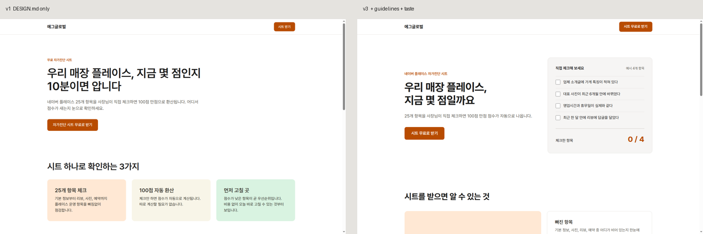

# design-lab: 클로드코드 디자인 스킬 5종 실습

원문: [클로드한테 디자인 시키기 전에 깔아야 하는 5개 (게으른 빌더)](https://lazyowen.com/guides/claude-design-top-5-skill)
실습 대상: `blog-strategy/03-funnel.md`의 **LM-1 플레이스 자가진단 시트 신청 랜딩**



## 설치 현황 (프로젝트 단위, `.claude/skills/`)

| 도구 | 출처 | 설치 명령 | 상태 |
|---|---|---|---|
| DESIGN.md | VoltAgent/awesome-design-md (`notion`) | `curl -o DESIGN.md …/design-md/notion/DESIGN.md` | `design-lab/DESIGN.md` + 에그글로벌 오버라이드 |
| agent-browser | vercel-labs/agent-browser | `npx --yes skills@latest add vercel-labs/agent-browser --agent claude-code --yes --copy` + `npm i -g agent-browser` | 스킬 설치 완료, CLI 0.27.0 |
| web-design-guidelines | vercel-labs/agent-skills | `… add vercel-labs/agent-skills --skill "web-design-guidelines" …` | 설치 완료 |
| design-taste-frontend | Leonxlnx/taste-skill | `… add https://github.com/Leonxlnx/taste-skill --skill "design-taste-frontend" …` | 설치 완료 |
| image-to-code | Leonxlnx/taste-skill | `… --skill "image-to-code" …` | 설치 완료, **사용 조건부** (아래 참고) |

설치 버전 고정: 저장소 루트 `skills-lock.json` (해시 포함)

## 단계별 결과

| 단계 | 한 일 | 발견한 것 |
|---|---|---|
| 1. DESIGN.md | Notion 규칙 적용, 주색 보라 → 앰버 `#b84c00`(흰 글자 대비 5.16:1), 글꼴 Inter → Pretendard | 규칙만 줘도 "AI 기본값" 느낌은 사라짐. 단 히어로 우측이 비고, 카드 3장이 똑같음 |
| 2. agent-browser | 1440px / 375px / 다크 모드 캡처로 직접 확인 | **Pretendard가 로드되지 않은 것**을 화면에서 발견 (CDN 차단). 코드만 봤으면 못 잡았을 문제 → 폰트 자체 호스팅으로 해결 |
| 3. web-design-guidelines | 규칙 190줄 기준 검사 | **14건 지적.** 핵심은 폼 라벨이 입력칸과 연결되지 않음(스크린리더 불가), 필수값 검증 없음, 포커스 표시 없음 |
| 4. Taste | 다이얼 5 / 3 / 4 (신뢰 우선 랜딩) | 위반 6건: 똑같은 카드 3장, 히어로에 실제 시각 요소 없음, CTA 문구 3종 혼용, 다크 모드 없음, **"10분이면 압니다" 근거 없는 수치**, 입력칸 테두리 대비 1.74:1 |
| 5. image-to-code | 설치만 | SKILL.md가 **Codex 이미지 생성 전제**. Claude Code 단독으로는 1단계(이미지 생성)가 건너뛰어짐 → 참고 이미지를 사람이 공급할 때만 사용 |

## 배포 전 남은 일 (TODO)

- [ ] `index.html`의 폼 `action="#"`을 실제 구글폼 또는 웹훅 주소로 교체
- [ ] **개인정보 수집·이용 동의 체크박스와 처리방침 링크 추가** (개인정보 보호법 제15조, 필수)
- [ ] 히어로 미리보기의 예시 4개 항목을 `diagnostic-items.md`의 실제 25개 항목 중 4개로 교체
- [ ] 브랜드 주색 확정 (현재 `#b84c00`은 임시값)

## 이 클라우드 환경에서만 필요했던 우회

- `agent-browser install`이 Chrome 다운로드 단계에서 네트워크 정책에 막힘 → 미리 설치된 Chromium 사용
  `export AGENT_BROWSER_EXECUTABLE_PATH=/opt/pw-browsers/chromium`
- `cdn.jsdelivr.net` 차단 → Pretendard를 npm에서 받아 `fonts/`에 자체 호스팅 (SIL OFL 1.1, `fonts/LICENSE-Pretendard-OFL.txt`)

로컬 PC에서는 원문 명령어 그대로 동작합니다.

## 로컬에서 보기

```bash
cd design-lab && python3 -m http.server 8765
# 브라우저에서 http://localhost:8765
```
